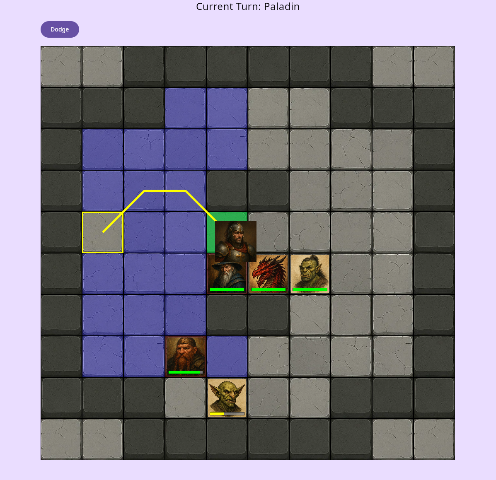

# ⚔️ Table Top Role Player Game Combat Simulator

A combat simulator using 5e SRD mechanics, supporting both SRD 5.1 and SRD 5.2.1 (CC-BY-4.0).

---

## 📜 Licensing & Legal

This project uses rules / data from:

- **SRD 5.1** — released under the *Creative Commons Attribution 4.0 International (CC-BY-4.0)* license.
- **SRD 5.2.1** — released under the *Creative Commons Attribution 4.0 International (CC-BY-4.0)* license.

---

## ⚠️ Disclaimer

This project is **not affiliated with** or **endorsed by** Wizards of the Coast.
“Dungeons & Dragons”, “D&D”, and related names/trademarks are the property
of Wizards of the Coast.

Only content from SRD 5.1 and SRD 5.2.1 is used. No Product Identity
(official settings, unique monsters, named characters, etc.) is included.
